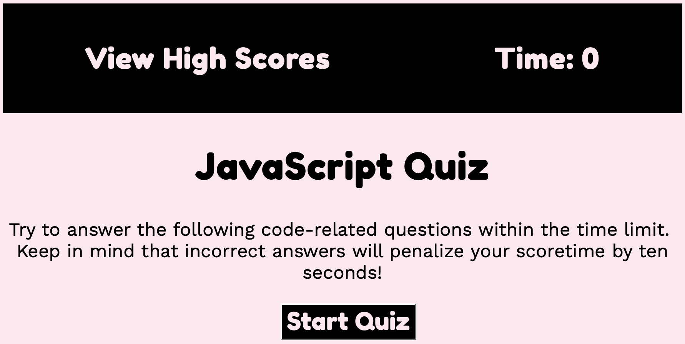
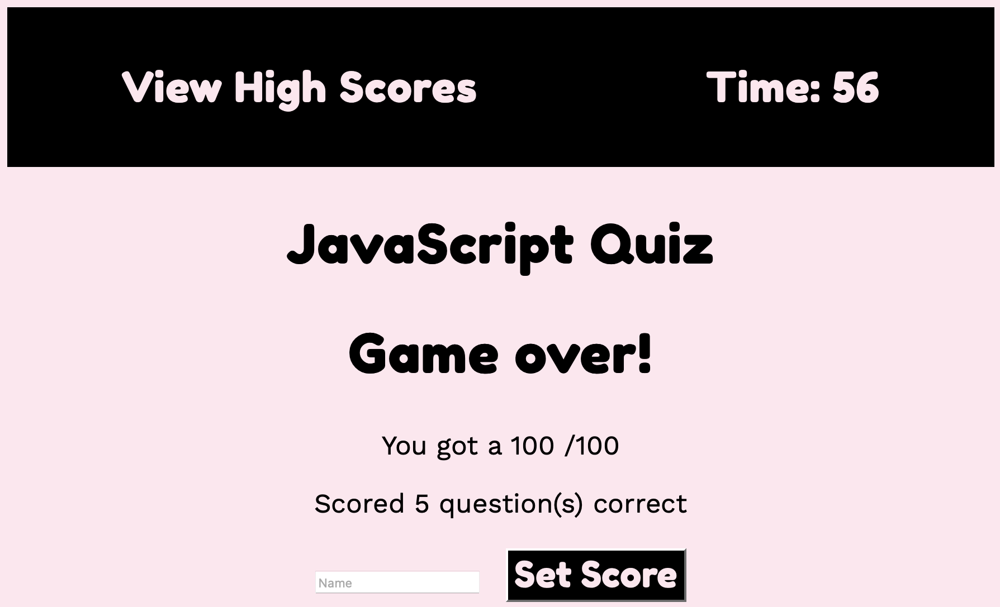

# Code-Quiz

## Description

Test your JavaScript knowlegde with multiple-choice questions!

### 1. Click "Start Quiz"
- Timer on top right wil start to run
- Total time is 60 seconds with 5 questions
- The "View High Scores" link top left will direct users to view current high scores

### 2. Questions are presented with multiple choice answers
- If the question is answered correctly, will add 20 points to score
- if the question is answered wrong, 

### 3. When all questions are answered or the timeer reaches 0, GAME OVER

## Below is the Code Quiz demo:
### [Code Quiz Link](https://ctinengyn.github.io/Code-Quiz/)

